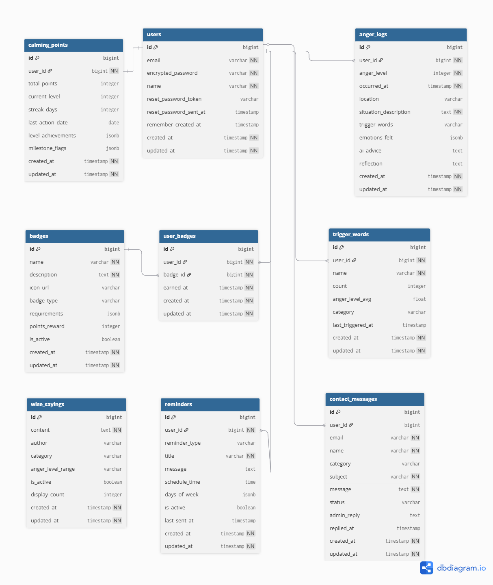

### ER図

### 本サービスの概要（700文字以内）

Angoriは、ゴリラをモチーフにしたエンタメ性のあるアンガーマネジメントアプリです。 
ASDやHSPなどの感情コントロールの難しさや繊細さを持つユーザに対しても使いやすく、怒りの感情の持続時間や怒りの強度を小さくすることを目指します。

主要機能として、詳細な怒りログ記録、OpenAI GPT-4o-miniを活用した相談内容に対するアドバイス、どれくらい今までアンガーマネジメントに取り組んだか、ポイントによるゲーミフィケーション機能を提供します。D3.js Packed Bubble Chartで怒りのトリガとなるワードを可視化し、ユーザーが怒りパターンを直感的に理解できる仕組みを構築。従来のアンガーマネジメントツールにはない、多様性への配慮と科学的アプローチを両立。ユーザが自身の成長過程を楽しく追跡し、持続的な感情制御スキルを上げることをサポートします。

### MVPで実装する予定の機能
- [ ] アプリの解説画面の追加(新規ユーザ向け, '/')
- [ ] ユーザ登録機能
- [ ] ユーザ確認機能
- [ ] ログイン機能
- [ ] トップ画面の表示(相談室への導線、最近のアンガーログ一覧、MVP以降実装予定のスコア表など)
- [ ] アンガーマネジメント相談機能
- [ ] 相談内容に対するAIアドバイス機能
- [ ] 過去のアンガーログ一覧画面
- [ ] 過去のアンガーログ詳細画面

### ER図の注意点
- [x] プルリクエストに最新のER図のスクリーンショットを画像が表示される形で掲載できているか？
- [x] テーブル名は複数形になっているか？
- [x] カラムの型は記載されているか？
- [x] 外部キーは適切に設けられているか？
- [x] リレーションは適切に描かれているか？多対多の関係は存在しないか？
- [x] STIは使用しないER図になっているか？
- [x] Postsテーブルにpost_nameのように"テーブル名+カラム名"を付けていないか？